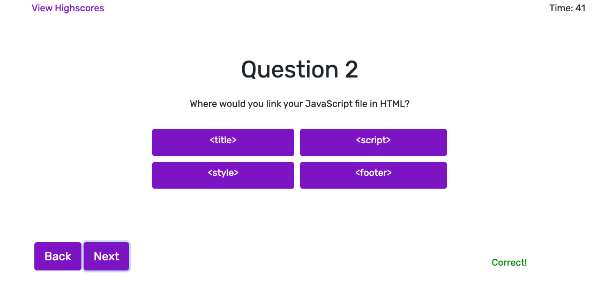

# Code Quiz

## Description

A short quiz to test the user's coding knowledge. The user will have 60 seconds to answer all questions, and will lose 5 seconds for every wrong answer. Once finished, the score will be aggregated and the user will have the option to save their highscore.

## Technologies

* HTML
* CSS
* JavaScript
* jQuery
* Bootstrap 4

## Goal of the Project

#### Build a timed code quiz with multiple-choice questions

In order to ensure the web application is responsive, I used Bootstrap's components and grid layout so that the contents are intact in a variety of screen sizes. To do this, I needed to use relational ratio for positions and widths and heights. In addition, I needed a navigation bar and a footer that was consistent through all pages and would be responsive.

As a quiz, I needed to have a start button to commence the timer button, and show the questions. Once an an option was chosen, the user will be notified whether their answer was correct and will not be able to change their answer. Finally, the score will need to be increase by 1 for every correct answer, and the user should see their total score after submitting their answers.

## Usage

The following image is an example of the web application's appearance and functionality: 



## What I Did

#### Interactive Buttons

Use of buttons that allow user to navigate the application

```
previousBtn.addEventListener('click', showPreviousSlide)
nextBtn.addEventListener('click', showNextSlide)

function showNextSlide() {
    showSlide(currentSlide + 1);
    for (let i=0; i<optBtn.length; i++){
        optBtn[i].removeAttribute("disabled", "")
    }
}

function showPreviousSlide() {
    showSlide(currentSlide - 1);
}
```
#### Inline Comments

Use of inline comments to tell user whether answer was correct or incorrect

```
var checkStatus = event.target.classList

var ansStatus = document.querySelector('.answer-status')
if ( checkStatus.contains('correct') ) {
    score += 1
    ansStatus.style.color = "green"
    ansStatus.textContent = "Correct!"
    
} else {
    ansStatus.style.color = "red"
    ansStatus.textContent = "Wrong!"
    
    // remove 5 secs from timer
    timeLeft -= 5
}
```

#### Timer

```
var timeLeft = 60

function setTime(){
    console.log("counting down ...")

    var timerInterval = setInterval(function(){
        timeLeft--;
        timeEl.textContent = "Time: " + timeLeft
        if (timeLeft == 0) {
            clearInterval(timerInterval)
            endQuiz();
        }else if (document.getElementById('end').classList.contains('active-slide')){
            clearInterval(timerInterval)
        }

    }, 1000); 
    
}
```

#### HighScores

```
let score = 0

$('.option-btn').on('click', function(event){
    
    var checkStatus = event.target.classList

    if ( checkStatus.contains('correct') ) {
        score += 1
    } 
    console.log(score)
})

function endQuiz(){

    var endSlide =  document.querySelector('#end')
    endSlide.children[0].textContent += score

    endSlide.innerHTML += `<button id="add-user" class="btn" type="button">Add</button>`
}
```

## URL

See the web application [here](https://scaredofseagles.github.io/Code-Quiz/)

## Source

This quiz was partly inspired by tutorials by [@WebDevSimplified](https://github.com/WebDevSimplified/JavaScript-Quiz-App) and Yaphi Berhanu and James Hibard from [Sitepoint](https://www.sitepoint.com/simple-javascript-quiz/)

## License 

MIT License

Copyright (c) 2020 Dailey Kaze

Permission is hereby granted, free of charge, to any person obtaining a copy of this software and associated documentation files (the "Software"), to deal in the Software without restriction, including without limitation the rights to use, copy, modify, merge, publish, distribute, sublicense, and/or sell copies of the Software, and to permit persons to whom the Software is furnished to do so, subject to the following conditions:

The above copyright notice and this permission notice shall be included in all copies or substantial portions of the Software.

THE SOFTWARE IS PROVIDED "AS IS", WITHOUT WARRANTY OF ANY KIND, EXPRESS OR IMPLIED, INCLUDING BUT NOT LIMITED TO THE WARRANTIES OF MERCHANTABILITY, FITNESS FOR A PARTICULAR PURPOSE AND NONINFRINGEMENT. IN NO EVENT SHALL THE AUTHORS OR COPYRIGHT HOLDERS BE LIABLE FOR ANY CLAIM, DAMAGES OR OTHER LIABILITY, WHETHER IN AN ACTION OF CONTRACT, TORT OR OTHERWISE, ARISING FROM, OUT OF OR IN CONNECTION WITH THE SOFTWARE OR THE USE OR OTHER DEALINGS IN THE SOFTWARE.